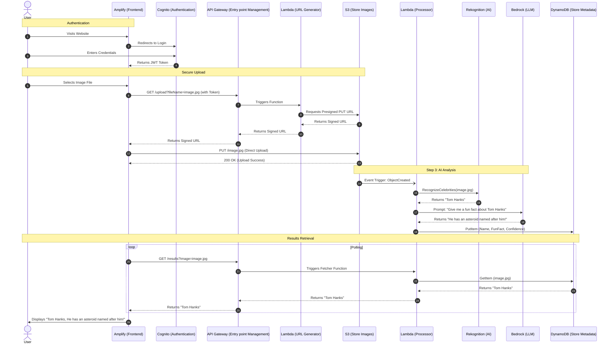

# AI Celebrity Spotter

## Project Overview
A full-stack, serverless web application that identifies celebrities in user uploaded images and provides AI-generated fun facts using Amazon Web Services (AWS).
This functions as an end-to-end showcase of knowledge aquired in CS 2060: Intro to Cloud Computing at PITT!

## Architecture
The application is built on **AWS** using the following:
- **DevOps:** Simple script ussing HTML5, Tailwind CSS, JavaScript, React managed by **Amplify**.
- **Security:** User authentication managed by **Cognito** and least-privilege roles managed by **IAM**.
- **Networking:** RESTful entry point managed by **API Gateway** taht triggers compute.
- **Compute:** Python scripts for backend logic managed by **Lambda**.
- **Storage:** Secure and bulk image hosting via Presigned URLs managed by **S3**.
- **AI/ML:** Facial recognition managed by **Rekognition** and generative trivia managed by **Bedrock**. Image analysis is event-driven, triggered automatically by an image upload.
- **Database:** Persistent metadata storage managed by **DynamoDB**.
- **Monitoring:** Logs for troubleshooting managed by **CloudWatch**.

*Note*: 11 AWS services are used in this project.

### Sequence Diagram

## Installation and Setup
1. Clone the repository
2. Deploy the backend:
   a. Create a S3 Bucket and enable CORS with `PUT` and `GET` methods allowed for the frontend origin.
   b. Create a DynamoDB table named `ImageMetadata` and set the partition key to a string `ImageID`.
   c. Set project roles for S3 and the Lambda functions through IAM.
   d. Deploy the three Lambda functions: Generator, Processor, Fetcher.
      - Generator: Generates the presigned URL.
      - Processor: Triggered by S3; handles AI logic.
      - Fetcher: Queries DynamoDB for information to be sent to the frontend.
   e. Configure API Gateway with `/upload` and `/results` resources. Add `GET` methods to both resources and set integration type for lambda function. Configure `/upload` with the `generator` lambda and `/results` with the `fetch` lambda. 
   f. Go to the Bedrock console and request access for `Claude 3 Haiku`.
   g. Setup CloudWatch monitoring as needed.
3. Configure the frontend:
   - Update `index.html` with your `API_BASE_URL` and `COGNITO_DOMAIN`.
4. Deploy the Frontend:
   - Connect your GitHub repo to AWS Amplify for CI/CD deployment.

## Troubleshooting (CORS)
This project implements strict CORS policies for security. Ensure that the S3 Bucket CORS and API Gateway Gateway Responses are configured to allow your Amplify domain.

## AI Use
The Gemini LLM was very helpful in setting up the frontend user interface, as well as with troubleshooting steps to take when I hit a wall.