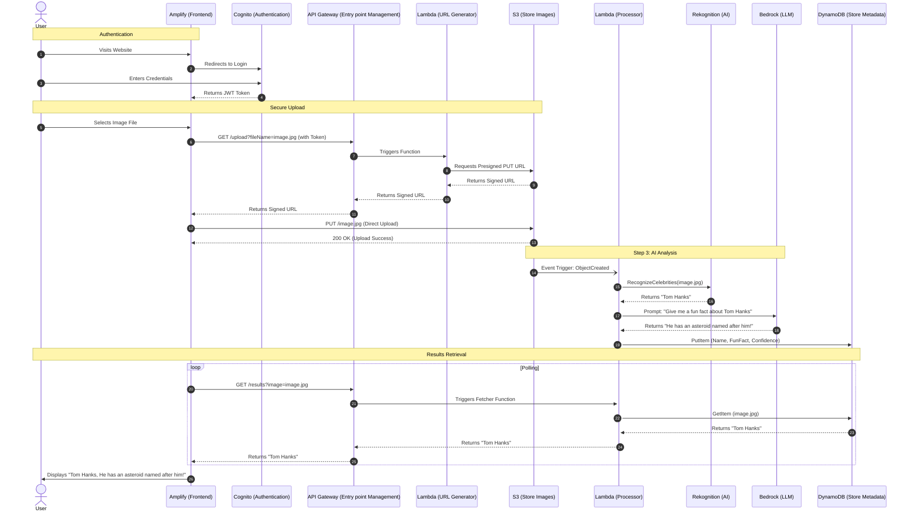

# AI Celebrity Spotter

## Project Overview
A full-stack, serverless web application that identifies celebrities in user uploaded images and provides AI-generated fun facts using Amazon Web Services (AWS).
This functions as an end-to-end showcase of knowledge aquired in CS 2060: Intro to Cloud Computing at PITT!

## Website
[AI Celebrity Spotter](https://main.d3avkfapvvo9ac.amplifyapp.com)

## Video Demonstration
[Video](https://www.youtube.com/watch?v=Iw9FMSpVF9c)

## Project Structure
```text
.
├── index.html
├── images
│   ├── *.*
└── lambdas
    ├── fetcher.py
    ├── generator.py
    ├── historier.py
    ├── processor.py
```

## Architecture
The application is built on **AWS** using the following:
- **DevOps:** Simple script using HTML5, Tailwind CSS, JavaScript/React managed by **Amplify**.
   * *Justification*: **Amplify** was chosen to streamline my CI/CD pipeline. It is the **Deployment Automation** of the frontend directly from the repository, handles SSL certificates, and provides global content delivery via Amazon’s CDN.
- **Security:** User authentication managed by **Cognito** and least-privilege roles managed by **IAM**.
   * *Justification*: **Cognito** is the **Authentication Layer** and provides a secure, scalable user directory that handles OAuth 2.0 and OIDC through its User Pools and Identity Pools. **IAM** enforces a Zero-Trust architecture by using "Least-Privilege" policies. That said, I set up a very lenient policy in order to rapidly prototype this project.
- **Networking:** RESTful entry point managed by **API Gateway** that triggers compute.
   * *Justification*: **API Gateway** acts as a managed front door that handles high-concurrency traffic, protects  against DDoS attacks, and provides a unified RESTful interface. It decouples the frontend from the backend, allowing the API to scale automatically and manage versioning without impacting the user experience.
- **Compute:** Python scripts for backend logic managed by **Lambda**.
   * *Justification*: **Lambda** enables a Serverless compute model, eliminating the overhead of managing virtual servers.
- **Storage:** Secure and bulk image hosting via Presigned URLs managed by **S3**.
   * *Justification*: **S3** is a great tool for handling bulk image hosting. It uses Presigned URLs, so the application enhances security by allowing the client to upload images directly to S3 without exposing AWS credentials to the frontend.
- **AI/ML:** Facial recognition managed by **Rekognition** and generative trivia managed by **Bedrock**. Image analysis is event-driven, triggered automatically by an image upload.
   * *Justification*: **Rekognition** provides specialized, high-accuracy computer vision for celebrity identification, while **Bedrock** (Claude 3) provides advanced reasoning to generate interesting, non-repetitive trivia. The event-driven trigger (S3 → Lambda) ensures that analysis begins the millisecond an image is saved, providing a near-instantaneous user experience.
- **Database:** Persistent metadata storage managed by **DynamoDB**.
   * *Justification*: **DynamoDB** is a NoSQL database that provides minimal latency at scale. It is also a form of **Persistent Storage**, which ensures that celebrity data remains available for the history feature of this web app, long after the ephemeral compute has finished.
- **Monitoring:** Logs for troubleshooting managed by **CloudWatch**.
   * *Justification*: **CloudWatch** allows for real-time monitoring and detailed error logging.

*Note*: 10 AWS services are used in this project.

### Sequence Diagram


## Installation and Setup
1. Clone the repository
2. Deploy the backend:
   a. Create a S3 Bucket and enable CORS with `PUT` and `GET` methods allowed for the frontend origin.
   b. Create a DynamoDB table named `ImageMetadata` and set the partition key to a string `ImageID`.
   c. Set project roles for S3 and the Lambda functions through IAM.
   d. Deploy the three Lambda functions: Fetcher, Generator, Historier, and Processor.
      - Generator: Generates the presigned URL.
      - Processor: Triggered by S3; handles AI logic.
      - Fetcher: Queries DynamoDB for information to be sent to the frontend.
   e. Configure API Gateway with `/upload`, `/results`, and `/history` resources. Add `GET` methods to both resources and set integration type for lambda function. Configure `/upload` with the `generator` lambda, `/results` with the `fetcher` lambda, and `/history` with the `historier` lambda. 
   f. Go to the Bedrock console and request access for `Claude 3 Haiku`.
   g. Setup CloudWatch monitoring as needed.
3. Configure the frontend:
   - Update `index.html` with your `API_BASE_URL` and `COGNITO_DOMAIN`.
4. Deploy the Frontend:
   - Connect your GitHub repo to AWS Amplify for CI/CD deployment.

## Troubleshooting (CORS)
This project implements strict CORS policies for security. Ensure that the S3 Bucket CORS and API Gateway Gateway Responses are configured to allow your Amplify domain.

## AI Use
The Gemini LLM was very helpful in setting up the frontend user interface, as well as with troubleshooting steps to take when I hit a wall.